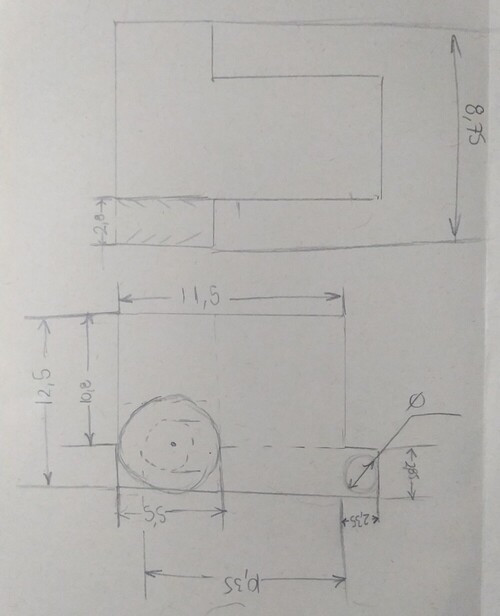
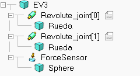
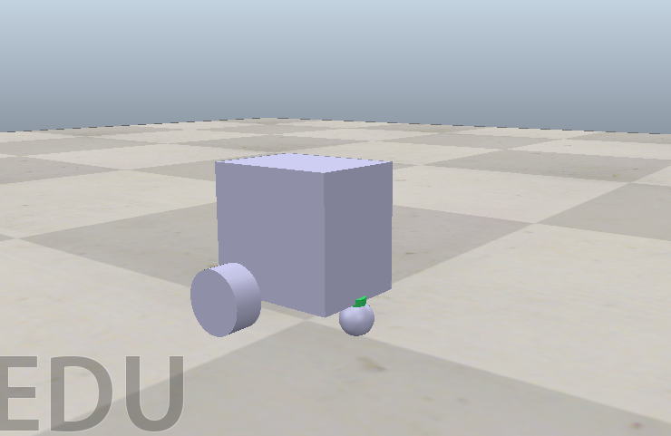

# Laboratorio 1
## 6. Sensores del robot: Identificar los sensores incorporados en los robots y explicar su funcionamiento. Que compatibildiad tienes con otros sensores.
### Sensor de color: 
Funciona utilizando una combinación de fotorreceptores que son sensibles a diferentes longitudes de onda de la luz. Cuando la luz entra en el sensor a través de su ventana, los fotorreceptores detectan la intensidad de la luz en diferentes rangos de longitud de onda, lo que permite al sensor determinar el color del objeto que está siendo observado. Además, en el modo de intensidad de la luz reflejada, el sensor mide la cantidad de luz reflejada desde una fuente, mientras que en el modo de intensidad de la luz ambiental, mide la cantidad de luz que ingresa desde el entorno. Esto se logra mediante el uso de circuitos electrónicos que convierten la luz en señales eléctricas que pueden ser interpretadas por el microcontrolador del robot.

### Girosensor: 
Este sensor utiliza un componente llamado giroscopio para detectar el movimiento de rotación en un eje. Un giroscopio consiste en un rotor que gira libremente dentro de un marco, y cuando el marco gira, el rotor tiende a mantener su orientación original en el espacio. La velocidad a la que el rotor tiende a mantener su orientación se traduce en una señal eléctrica proporcional a la velocidad de rotación, que puede ser interpretada por el microcontrolador del robot. Además, el ángulo de rotación total se calcula integrando la velocidad de rotación en el tiempo.

### Sensor táctil: 
Este sensor funciona mediante la detección de cambios en la resistencia eléctrica cuando se presiona el botón rojo del sensor. Cuando se presiona el botón, se produce un contacto eléctrico que permite que la corriente fluya a través del sensor, lo que se traduce en una señal eléctrica que indica que el botón ha sido presionado. Cuando se suelta el botón, el contacto eléctrico se interrumpe y la corriente deja de fluir, lo que también se detecta como una señal eléctrica por el microcontrolador del robot.

### Sensor ultrasónico: 
Este sensor emite pulsos de sonido de alta frecuencia y luego mide el tiempo que tarda cada pulso en reflejarse de vuelta desde un objeto cercano. Utiliza la velocidad del sonido en el aire para calcular la distancia al objeto según la fórmula distancia = velocidad x tiempo. Esta información se convierte en una señal eléctrica que indica la distancia al objeto, que puede ser interpretada por el microcontrolador del robot.

### Sensor infrarrojo y Baliza infrarroja remota: 
Estos sensores funcionan detectando la luz infrarroja reflejada por objetos sólidos o las señales de luz infrarroja enviadas por la baliza remota. Utilizan fotorreceptores sensibles a la luz infrarroja para convertir la luz en señales eléctricas que pueden ser interpretadas por el microcontrolador del robot. Dependiendo del modo de operación (proximidad, baliza o remoto), el sensor interpreta estas señales para determinar la distancia al objeto, la dirección de la baliza y otros parámetros relevantes.

### Compatibilidad con otros sensores:

El EV3 es compatible con los sensores y motores de la versión NXT, ya que utilizan los mismos cables conectores (RJ12) y el software EV3 los reconoce. Sin embargo, los sensores del EV3 no funcionan en el ladrillo NXT, solo los motores. En foros se habla del uso de sensores cumunmente usados con diferentes tarjetas de desarrollo como arduino, pero se requiere de un enlace I2C entre la tarjeta de desarrollo y el EV3.

## 8. Simulación en CoppeliaSim del robot EV3
Utilizado el software CoppeliaSim, se crean la simulación del robot EV3, primero se determine las medidas del robot para hacer lo más realista la simulación.
<picture>
 <source media="(prefers-color-scheme: dark)" srcset="Medidas.jpg">
 <source media="(prefers-color-scheme: light)" srcset="Medidas.jpg">
 
</picture>

Se crean la estructura general del robot utilizando un cubo, dos cilindros conectados con unión de revolución y una esfera conectada a un sensor de fuerza, como se muestra en la siguiente imagen:

<picture>
 <source media="(prefers-color-scheme: dark)" srcset="Estructura.png">
 <source media="(prefers-color-scheme: light)" srcset="Estructura.png">
 
</picture>

A continuacion se ve el resultado de la simulación:

<picture>
 <source media="(prefers-color-scheme: dark)" srcset="Simulacion.png">
 <source media="(prefers-color-scheme: light)" srcset="Simulacion.png">
 
</picture>

Funcionamiento de la simulación:

https://github.com/JSDaleman/Robotica-movil-Lab1/assets/68557324/989df357-6d5c-4fc5-9b71-7a0bb20031db

